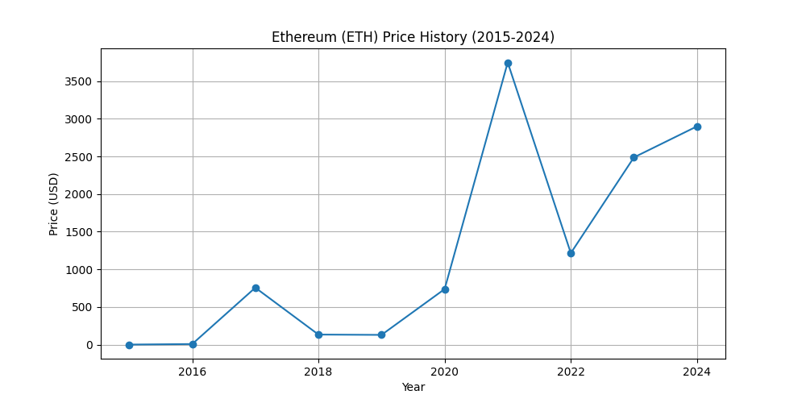

# lcel_playground
Welcome to the LCEL playground! This is where I'll be tinkering with all things LangChain Expression Language.

## RAG Test

### Q1: What is the investment perspective of BII in December 2024?
> A: In December 2024, the BlackRock Investment Institute (BII) emphasizes that Bitcoin may be suitable for investors who are comfortable with the risks of significant price volatility. They note the historical drawdowns of Bitcoin and provide insights on its potential role in diversified portfolios. However, the information does not constitute investment advice or recommendations.

### Q2: 文中提到对BTC投资的态度是什么，有哪些观点佐证？
> A: 文中提到对BTC投资的态度是支持的，认为未来广泛采用是其投资价值的核心。观点包括比特币能够实现无缝和即时的跨境交易，以及其去中心化特性使得供应量不受政府直接控制。此外，文章指出，投资者需要平衡比特币的潜在收益与其快速价格波动的风险，以决定是否将其纳入多元化投资组合。

### Q3: 文中提到的“magnificent 7”对BTC的影响有哪些？
> A: “Magnificent 7” stocks impact Bitcoin (BTC) by representing a similar level of portfolio risk when allocated in small amounts, specifically around 1-2%. If BTC's allocation exceeds 2%, its risk contribution becomes significantly larger compared to these tech stocks, particularly during volatile periods. Therefore, a cautious approach is suggested, with a maximum allocation of 2% to manage overall portfolio risk.

## Multi-Chain Demo

> python src/lcel_playground/multi_chain_demo.py
### Q1: 解释一下quicksort算法

### A1:
Sure! Let's dive deeper into the Quicksort algorithm and break down the concepts step by step to ensure clarity for beginners.

### Understanding Quicksort

Quicksort is a highly efficient sorting algorithm that uses a method called "divide and conquer." Here’s a simple breakdown of how it works.

### Steps of Quicksort

1. **Choosing the Pivot**: 
   - The pivot is a value from the array used to divide the array into two parts. You can choose the pivot in various ways (for instance, the first element, the last element, or a random element). In our examples, we chose the last element for simplicity.

2. **Partitioning the Array**:
   - The goal is to rearrange the array so that all elements less than the pivot come before it, and all elements greater than the pivot come after it. This process is called partitioning.
   - After partitioning, the pivot is in its correct position in the sorted array.

3. **Recursively Sorting the Sub-arrays**:
   - After the pivot is placed in the correct position, Quicksort is called recursively on the two sub-arrays formed by the pivot.
   - This process continues until the base case is reached (an array with one or no elements), which is trivially sorted.

### Example Walkthrough

Let’s clarify with a detailed example using the array `[3, 6, 8, 10, 1, 2, 1]`:

1. **Choose a Pivot**: Let’s take `1` as the pivot (the last element).

2. **Partitioning**:
   - We go through the elements:
     - `3`: greater than `1`, goes to the right.
     - `6`: greater than `1`, goes to the right.
     - `8`: greater than `1`, goes to the right.
     - `10`: greater than `1`, goes to the right.
     - `1`: equal to `1`, goes to the left.
   - After partitioning, we might have `[1, 1, 2, 3, 6, 8, 10]` where `1` is in its final position.

3. **Recursive Calls**:
   - Now we have two sub-arrays: `[]` (left of the pivot) and `[3, 6, 8, 10]` (right of the pivot).
   - Both sub-arrays are sorted using the same logic.

### Python Code Review

Let’s take a look at the Python implementation again:

```python
def quicksort(arr):
    if len(arr) <= 1:
        return arr
    
    pivot = arr[-1]  # Choosing the last element as the pivot
    less_than_pivot = []
    greater_than_pivot = []
    
    for element in arr[:-1]:  # Exclude the pivot from this loop
        if element <= pivot:
            less_than_pivot.append(element)
        else:
            greater_than_pivot.append(element)
    
    # Recursively sort the partitions and combine them
    return quicksort(less_than_pivot) + [pivot] + quicksort(greater_than_pivot)

# Example usage
if __name__ == "__main__":
    example_array = [3, 6, 8, 10, 1, 2, 1]
    sorted_array = quicksort(example_array)
    print("Sorted array:", sorted_array)
```

### Key Points in the Code:

- **Base Case**: The function checks if the list is empty or has just one element. If so, it returns the list as it is already sorted.
  
- **Pivot Selection**: The last element of the array is selected as the pivot.

- **Partitioning**: Two lists (`less_than_pivot` and `greater_than_pivot`) are created to hold elements less than and greater than the pivot, respectively.

- **Recursive Calls**: The function calls itself on the two partitions, sorting them.

- **Combining Results**: The final sorted array is formed by concatenating the sorted left partition, the pivot, and the sorted right partition.

### Rust Code Review

Now, let’s review the Rust implementation:

```rust
fn quicksort(arr: &mut [i32]) {
    if arr.len() <= 1 {
        return; // Base case
    }

    let pivot_index = partition(arr);
    quicksort(&mut arr[0..pivot_index]); // Sort left partition
    quicksort(&mut arr[pivot_index + 1..]); // Sort right partition
}

fn partition(arr: &mut [i32]) -> usize {
    let pivot_index = arr.len() - 1; // Last element as pivot
    let pivot_value = arr[pivot_index];

    let mut i = 0; // Pointer for the larger element

    for j in 0..pivot_index {
        if arr[j] < pivot_value {
            arr.swap(i, j); // Swap elements
            i += 1; // Move the larger element pointer
        }
    }
    arr.swap(i, pivot_index); // Place pivot in its final position
    i // Return pivot index
}

fn main() {
    let mut arr = [3, 6, 8, 10, 1, 2, 1];
    quicksort(&mut arr);
    println!("Sorted array: {:?}", arr);
}
```

### Key Points in the Rust Code:

- **Mutable Slice**: The `quicksort` function receives a mutable slice of integers, allowing it to modify the original array.

- **Partitioning Logic**: Similar to Python, the `partition` function rearranges elements around the pivot and returns the index of the pivot.

- **Recursion**: The recursive calls sort the left and right partitions.

### Conclusion

Quicksort is an efficient and widely used sorting algorithm that leverages a divide-and-conquer approach. By understanding its steps and seeing implementations in both Python and Rust, you can appreciate its effectiveness and how it can be adapted to different programming languages. If you have any questions or need further clarification on any part, feel free to ask!

## LangGraph Chatbot Demo

### ChatBot

> Q: Trump币发行在哪条公链上？
> A: 特朗普币（TrumpCoin）是一种加密货币，通常在多个区块链上发行和交易。具体的发行链可能会有所不同，但常见的区块链平台包括以太坊（Ethereum）和波场（Tron）等。如果你是在寻找特定的特朗普币项目，建议查阅该项目的官方网站或相关的加密货币交易平台，以获取最新的发行和交易信息。
> PS: 在没有检索工具的加持下，LLM基于训练数据出现“幻觉”，给出了错误的答案

### ChatBot with Tools

> Q: Trump币发行在哪条公链上？
> A: Trump币（TRUMP）是基于Solana区块链发行的。这种加密货币主要是作为一种meme代币进行交易，并在Coinbase和Binance等交易所上市。
> PS: 在检索工具加持下，LLM通过关键字“Trump币 发行 公链”使用Tavily进行新闻检索后给出了实时性很强的回答 🎉


### Multi-Agent Chatbot

 - Research Agent: 负责检索信息
 - Chart Agent: 负责生成图表

> Q: Obtain the ETH price from 2008-2024, and generate a price chart(.png） to current folder(./) with python,"End the task after generating the table.

